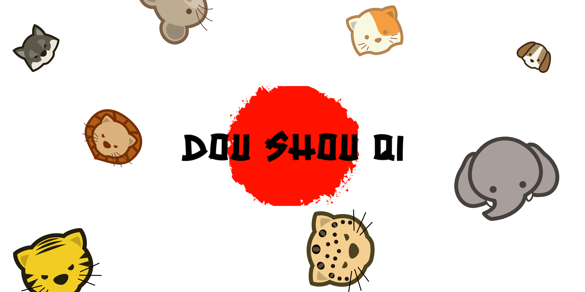
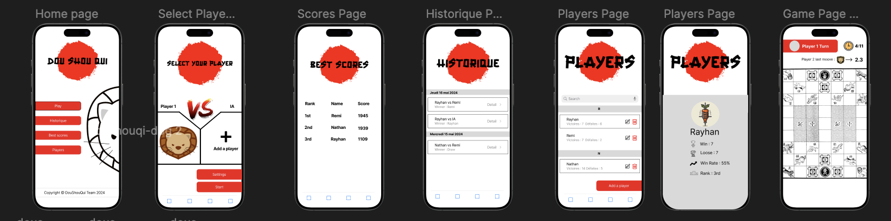

 
  
---

&nbsp; 
&nbsp; 
&nbsp; 

---

[Présentation](#présentation) | [Répartion](#répartition-du-gitlab) | [Fonctionnement](#fonctionnement) | [Deploiement](#deploiement)

## Présentation

**Nom de l'application** : Dou Shou Qi

**Contexte** : 

Dou Shou Qi, ou "Jeu de la Jungle", est un jeu de société chinois où deux joueurs déplacent des pièces représentant des animaux sur un plateau de 7x9 cases. Chaque animal a une force différente et peut capturer d'autres animaux selon une hiérarchie spécifique, sauf le Rat qui peut capturer l'Éléphant. Le but est de déplacer une de ses pièces dans la tanière de l'adversaire, tout en utilisant les rivières et les capacités spéciales des animaux pour capturer les pièces adverses et défendre sa propre tanière. 

**Récapitulation du Projet**: 👇

Ce projet à pour but de crée une application pour permettre de jouer à Dou Shou Qi sur des appareils Apple. Le but est de nous apprendre à utiliser Swift UI.

## Répartition du Gitlab

La racine de notre gitlab est composé de deux dossier : 

[**DouShouQi_App**](DouShouQi_App) : **Code de l'application**

[**Documentation**](Documentation) : **Regroupe l'entièreté  de la documentation**

 

:warning: Code de l'application en cours!

## Maquettes
Voici les maquettes de l'applicaton, celles sur qui nous nous sommes basé pour l'interface finale : 

## Fonctionnement

 

### Accueil 

Dans l'accueil, on pourra acceder aux différente pages du jeu tel que "Play" qui permet de lancer une partie, "Historique" qui permet de voir l'historique des parties trié par date, "Players" permettant d'ajouter de nouveaux joueurs, "Scores" permettant de voir les meilleurs joueurs, "Settings" pour changer la langue du jeu ou enlever le son et enfin "Ar" pour jouer en mode AR.

### Sélection des joueurs 

Par défaut, les joueurs sont en mode "IA", cliquez sur la selection des joueurs pour choisir et ensuite lancer la partie.

### Partie

En haut, le timer indique depuis combien de temps le jeu dure, cela indique aussi le tour du joueur. Les pions du joueur 1 sont en haut et ceux du joueur 2 en bas.

### Historique

Permet de consulter les historiques des parties, dont la durée de la partie, les participants et le gagnant.

### Meilleurs scores

Les meilleurs joueurs sont calculé en fonction de leur "WinRate" "le nombre de parties gagnées / le nombre de parties perdus * le nombres de parties jouées". Plus ce chiffre est haut, plus le joueur est haut dans le classement.

### Joueurs

Ajouter un player en cliquant "Add a player". Vous pouvez lui donnez un nom et une image. En appuyant sur un joueur, vous pouvez affichez ses details mais aussi le supprimer ou le modifier.

## Déploiement

- [x] &nbsp; 

## Branche de rendu 
Master

## Techniciens

